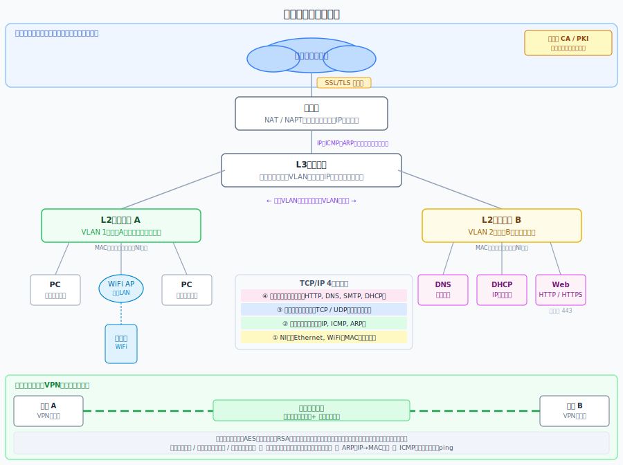

# ネットワークのしくみ

- **著者**：Gene
- **読了日**：

---

## 主張

ネットワークとは「決まった役割を持つ層（TCP/IP）と機器（ルータ・スイッチ）が連携してデータを正しく届ける仕組み」であり、その原理を理解することでLAN構成・インターネット通信・セキュリティまでを一貫して把握できる。

### 根拠・論理構造

- ネットワークはTCP/IP 4層モデルで成り立っており、各層が「何を・どこへ・どうやって」送るかを分担して通信を実現している
- 同一ネットワーク内の転送はL2スイッチ（MACアドレス）、異なるネットワーク間の転送はルータ・L3スイッチ（IPアドレス）が担うという明確な役割分担がある
- VLANによる論理分割とL3スイッチによるVLAN間通信の組み合わせで、物理構成を変えずに柔軟なネットワーク設計が可能
- 通信のセキュリティは暗号化（共通鍵・公開鍵のハイブリッド）とPKIによる認証の2軸で担保されており、SSL/TLSはその実装例
- プライベートネットワークとインターネットの境界にはNATが存在し、アドレス変換によってセキュリティとIPアドレスの節約を両立している

---

## 知見メモ

### 第1章：ネットワークのきほん

- ネットワークは**プライベートネットワーク**（ユーザー限定）と**インターネット**（誰でも利用可）の2種類
- **イントラネット**：LANとWANで構成される社内ネットワーク
  - **LAN**：単一建物内の通信。自前で管理
  - **WAN**：建物間の通信（LAN同士を接続）。通信業者が構築・管理

### 第2章：ネットワークをつくるもの

- **ネットワークアーキテクチャ**：通信の決まり事の集まり（アドレス指定方法・データフォーマット・通信手順など）。現代はTCP/IPが主流
- 通信ルールの単位を**プロトコル**と呼び、その集まりがネットワークアーキテクチャ
- **ネットワーク機器**：ルータ・レイヤ2スイッチ・レイヤ3スイッチの3種類。いずれもデータ転送を担う
  - 転送処理の流れ：デジタル信号（0/1）に変換 → 転送先の決定 → データの送出
- **ネットワーク構成要素**
  - インターフェース/ポート：機器同士をつなぐ接続口（例：Ethernet）
  - リンク：インターフェース同士の接続
  - 伝送媒体：リンクに使うケーブル
- **L2スイッチ**：複数PCを上位ネットワーク（ルータ）につなぐ中継役。MACアドレスとポートの対応を管理。VLAN機能で部署ごとにネットワークを論理分割できる
- **L3スイッチ**：VLAN間（異なるネットワーク間）の通信を可能にする。L2スイッチだけではVLAN同士が通信できないため必要

### 第3章：ネットワークの共通言語TCP/IP

**TCP/IP 4層モデル**

| 層 | 役割 | 主なプロトコル | データの呼び名 |
|---|---|---|---|
| アプリケーション層 | アプリ機能のデータフォーマット・処理手順を規定 | HTTP、SMTP、POP3、DHCP、DNS | メッセージ |
| トランスポート層 | データを適切なアプリに振り分ける | TCP、UDP | セグメント／データグラム |
| インターネット層 | 複数ネットワーク間の転送（実行はルータ） | IP、ICMP、ARP | パケット／データグラム |
| ネットワークインタフェース層 | 同一ネットワーク内でのデータ転送 | Ethernet、WiFi、PPP | フレーム |

- ネットワークインタフェース層は通信相手と同じプロトコルを使う必要はない
- 各プロトコルは送信時に制御情報（ヘッダ）を付加する→**カプセル化**
- 受信時はヘッダに基づいて処理し、ヘッダを外して上位層へ渡す→**逆カプセル化**

**IP**
- エンドツーエンドの通信を担うプロトコル。IPヘッダにIPアドレス等を格納
- 転送の種類：**ユニキャスト**（1対1）／**ブロードキャスト**（同一ネットワーク全員）／**マルチキャスト**（特定グループ）
- **サブネットマスク**：IPアドレスのどこまでがネットワーク部かを示す（例：255.255.255.0 → 192.168.1.x が同一ネットワーク）
- **ネットワークアドレス**：`192.168.1.0/24` のように表記し、ネットワークとホストの範囲を指定
- **ブロードキャストアドレス**：そのサブネット全員へデータを送るアドレス

**IPアドレスの種類とNAT**
- **パブリックアドレス**：インターネット全体で一意。ISP契約時に割り当てられる
- **プライベートアドレス**：自由に設定可。プライベートネットワーク内で使用
- **NAT/NAPT**：プライベートネットワークからインターネットへ接続する際にアドレスを変換。内部IPの隠蔽・複数端末での1グローバルIP共有・グローバルアドレスの節約が目的

**ICMP・ARP**
- **ICMP**：IPに届達確認機能がないため、エラー通知と診断（pingなど）を担う
- **ARP**：IPアドレスからMACアドレスを解決するプロトコル。ARPリクエストで問い合わせ、結果をARPテーブルにキャッシュ

**ポート番号**
- どのアプリにデータを届けるかを識別する番号
  - **ウェルノウンポート**：プロトコルごとに事前定義（例：HTTPS=443）
  - **登録済みポート**：よく使われるサーバーアプリ用の既定番号
  - **ダイナミック/プライベートポート**：それ以外のアプリが動的に使用

**TCP vs UDP**
- **TCP**：通信確認あり。確実なデータ転送を保証
- **UDP**：振り分けのみ。確認なしで高速

**DNS・DHCP**
- **DNS**：ドメイン名（google.com等）をIPアドレスに変換する名前解決を行う
- **DHCP**：TCP/IP設定（IPアドレス等）を機器に自動配布する。DHCPサーバーに配布情報を登録して管理

### 第4章：Webサイトをみるしくみ

**HTTPメソッド**

| | GET | POST |
|---|---|---|
| 用途 | 情報の取得（商品一覧・ユーザー情報・検索など） | データ送信・処理依頼（フォーム送信・会員登録・ログイン・DB追加・ファイルアップロードなど） |
| パラメータの場所 | URLに付与 | リクエストボディに格納 |
| 冪等性 | あり（同じリクエストを何度送っても結果は同じ） | なし（同じ処理が二重登録されることがある） |
| その他の特徴 | 読み取り専用・再読み込みしやすい・ブックマーク可 | URLだけでは送信内容が見えない |

### 第5章：イーサネットと無線LAN

**L2スイッチとイーサネット**
- L2スイッチはMACアドレスを学習し、必要な相手にだけフレームを届ける
  1. 受け取ったフレームの送信元MACアドレスを見て、ポートとの対応を学習
  2. 宛先MACアドレスが既知なら該当ポートのみに転送
  3. 宛先が不明な場合は受信ポート以外の全ポートにフロード（ブロードキャストも同様）
- 別ネットワークへの経路判断はしない→それはルータ・L3スイッチの役割

**無線LANの接続フロー**
SSID（WiFi名）を発見 → アソシエーション要求 → 接続要求 → 認証 → 電波の暗号化 → DHCPでIPアドレス取得 → IP/MACで通信

- DHCPで配布される情報：IPアドレス・サブネットマスク・デフォルトゲートウェイ（LAN外に出るときのルータ）・DNSサーバー

**電波でデータを送る仕組み（変調）**
- 0/1の情報を波（電波）で表現して送信する
- 0/1の羅列をいくつかに区切り、複素平面上の点に写像する（例：16-QAMなら4ビットずつ）
  - 例：`0100` → `-1+3i`（実部 I、虚部 Q）
  - 送信波 = I × cos(2πft) + Q × sin(2πft)
- 流れ：`0/1` → 複素数 → 波
- 暗号化は波にする前（0/1の段階）に行う

### 第6章：ルーティング

**ルーティングの基本**
- 異なるネットワーク間のデータ転送をルーティングと呼び、ルータが担う（インターネット層で動作）
- ルータのインターフェースにIPアドレスを設定することでネットワーク同士を接続する
- ルーティング時：MACアドレスは直前の機器のものに書き換えられるが、送信元IPアドレスは変わらない

**L3スイッチ**
- L2スイッチにルータの機能を追加したネットワーク機器
  - 同一ネットワーク内：MACアドレスで転送（L2スイッチと同じ）
  - ネットワーク間：IPアドレスで転送（ルータと同じ）

**VLAN**
- L2スイッチを論理的に分割し、ネットワークを複数に分ける技術
- MACアドレステーブルにVLAN列を追加し、同一VLAN内を同じネットワークとして扱う→転送範囲を制限できる
- **タグVLAN**：スイッチ同士を1本のケーブルで接続する場合に、フレームにVLAN IDのタグを付与する仕組み。タグがないと、スイッチ間でどのVLANからのデータかを判断できなくなる
- VLAN間の通信にはルータまたはL3スイッチが必要。L3スイッチ内部の仮想インターフェースにIPアドレスを設定することでVLAN間通信が可能になる

### 第7章：ネットワークのセキュリティ技術

**暗号化方式**

| | 共通鍵暗号方式 | 公開鍵暗号方式 |
|---|---|---|
| 概要 | 暗号化・復号に同じ鍵を使う | 公開鍵で暗号化、秘密鍵で復号 |
| 課題 | 鍵の安全な共有・更新が難しい | 処理が重い |
| 代表例 | AES | RSA、楕円曲線暗号 |

- 公開鍵暗号は逆用途もあり：秘密鍵で署名 → 公開鍵で検証（ソフトウェアの配布元確認など）
- **PKI・認証局（CA）**：公開鍵の正当性を保証するインフラ。偽の公開鍵による中間者攻撃を防ぐ

**SSL/TLS（ハイブリッド方式）**
1. サーバーのデジタル証明書を取得し、なりすましでないことを確認
2. 証明書に含まれる公開鍵を取得
3. 公開鍵で共通鍵を暗号化してサーバーに送信
4. 以降は共通鍵でデータを暗号化して通信

→ 公開鍵方式は処理が重いため、鍵交換のみに使い、実際の通信は共通鍵で行うハイブリッド構成をとる

**インターネットVPN**
- インターネットを仮想的なプライベートネットワークとして扱う技術
- 拠点間のルータ同士を仮想的に接続する**トンネリング**を行い、その経路を通るデータを暗号化する
- 暗号化・復号はVPNルーターが担当

---

## 理解を後回しにした内容
